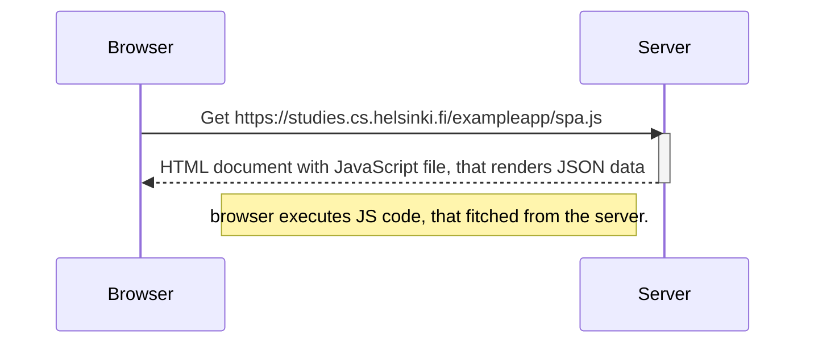

# Single page app diagram

```mermaid
sequenceDiagram

participant Browser
participant Server
    Browser->>Server:Get https://studies.cs.helsinki.fi/exampleapp/spa.js
    activate Server
    Server-->>Browser: HTML document with JavaScript file, that renders JSON data
    deactivate Server
    
    Note left of Server: browser executes JS code, that fitched from the server.
```